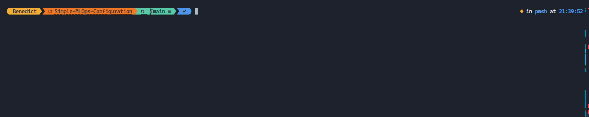
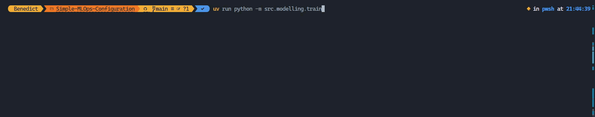
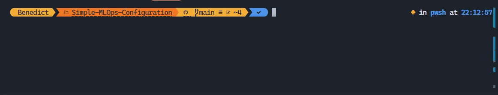

# Simple-MLOps-Configuration
MLOps Configuration for Simple Simulation

## Project Overview
This project demonstrates a simple MLOps configuration for a machine learning simulation. It includes data collection, preprocessing, model training, testing, and serving capabilities.

## Sample Data
The project uses [Wholesale Customer Dataset](https://archive.ics.uci.edu/dataset/292/wholesale+customers) for training and testing the model.

## Setup Instructions

### Package Manager Setup
This project uses `uv` as the package manager.<br>Install it following the instructions at https://github.com/astral-sh/uv

```
# On macOS and Linux.
curl -LsSf https://astral.sh/uv/install.sh | sh

# On Windows.
powershell -ExecutionPolicy ByPass -c "irm https://astral.sh/uv/install.ps1 | iex"
```

### Install Dependencies
```bash
uv venv
uv pip install -r pyproject.toml --all-extras
```

## Running the Pipeline

1. Data Collection
```bash
uv run python -m src.data.collect_data
```
This step collects and prepares the raw data for processing.


2. Data Preprocessing
```bash
uv run python -m src.data.preprocess_data
```
This step cleans and transforms the raw data into features suitable for model training.


3. Model Training
```bash
uv run python -m src.modelling.train
```
Trains the machine learning model using the preprocessed data.


4. Model Testing
```bash
uv run python -m src.modelling.test
```
Evaluates the trained model's performance on test data.


## Serving the Model
To serve the model as an API service:
```bash
uv run main.py
```
This command starts a service using LitServe, creating an API endpoint for model inference.

To hit the model serving, we can use `client.py` as an example
```bash
uv run client.py
```



## Container Deployment

### Building the Container
```bash
docker build -t mlops-simple-app:latest .
```

### Push to Docker Hub
```bash
# Login to Docker Hub
docker login

# Tag the image
docker tag mlops-simple-app:latest <your-dockerhub-username>/mlops-simple-app:latest

# Push the image
docker push <your-dockerhub-username>/mlops-simple-app:latest
```

### Deploy Using Docker
To deploy the application using Docker, follow these steps:

1. Pull the Docker image from Docker Hub:
```bash
docker pull <your-dockerhub-username>/mlops-simple-app:latest
```

2. Run the Docker container:
```bash
docker run -d --name mlops-app -p 8000:8000 <your-dockerhub-username>/mlops-simple-app:latest
```


This will start the application and expose it on port 8000.

### Deploy to Local Kubernetes (Docker Desktop)
```bash
# Enable Kubernetes in Docker Desktop if not already enabled:
# 1. Open Docker Desktop
# 2. Go to Settings > Kubernetes
# 3. Check "Enable Kubernetes"
# 4. Click "Apply & Restart"

# Verify Kubernetes is running
kubectl get nodes

# Create namespace for our application
kubectl create namespace mlops-staging

# Deploy the application
kubectl apply -f k8s/deployment.yaml -n mlops-staging

# Verify deployment
kubectl get pods -n mlops-staging
kubectl get services -n mlops-staging

# Access the application (if service type is LoadBalancer)
# The service will be available at localhost:<port>
kubectl get services -n mlops-staging
```

Note: Make sure Docker Desktop is running and Kubernetes is enabled before running these commands.

Note: Replace `<your-dockerhub-username>` with your actual Docker Hub username.

# CI/CD using Github Action

## GitHub Actions Workflows
This project includes two GitHub Actions workflows for CI/CD:

1. **Model Training and Evaluation** (`.github/workflows/model-training.yml`):
   - Trigger: Runs on push events to branches matching the pattern `dev/*`.
   - Steps:
     - Set up the environment (CML, Python, and `uv`).
     - Install dependencies.
     - Run the data collection, preprocessing, model training, and testing pipeline.
     - Generate a report on the model training pipeline and post it as a comment on the pull request.

2. **Deploy to Production** (`.github/workflows/deploy-production.yml`):
   - Trigger: Runs on push events to the `main` branch.
   - Steps:
     - Set up the environment (CML, Python, and `uv`).
     - Install dependencies.
     - Run the full pipeline (data collection, preprocessing, model training, and testing).
     - Generate a report on the model training pipeline and post it as a comment on the pull request.
     - Build and push the Docker image to Docker Hub.
     - Note: The deployment to Kubernetes is done manually since the cluster is local.

## Limitation
### Manual Deployment
Currently, the Docker and Kubernetes deployment is done manually since the cluster is local. Follow the steps above to deploy the application manually to your local Docker or Kubernetes cluster.

Even though the deployment is manual, the CI/CD pipeline automates the process up to building and pushing the Docker image to Docker Hub. This ensures that the latest version of the application is always available as a Docker image, ready to be deployed.
