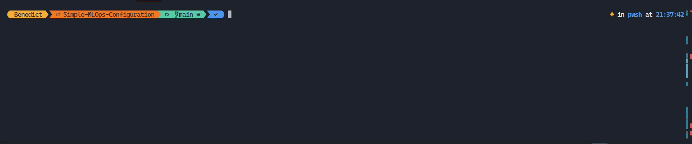
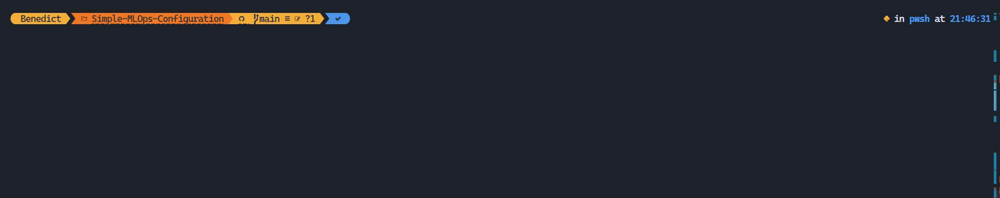

# Simple-MLOps-Configuration
MLOps Configuration for Simple Simulation

## Project Overview
This project demonstrates a simple MLOps configuration for a machine learning simulation. It includes data collection, preprocessing, model training, testing, and serving capabilities.

## Sample Data
The project uses [Wholesale Customer Dataset](https://archive.ics.uci.edu/dataset/292/wholesale+customers) for training and testing the model.

## Setup Instructions

### Package Manager Setup
This project uses `uv` as the package manager.<br>Install it following the instructions at https://github.com/astral-sh/uv

```
# On macOS and Linux.
curl -LsSf https://astral.sh/uv/install.sh | sh

# On Windows.
powershell -ExecutionPolicy ByPass -c "irm https://astral.sh/uv/install.ps1 | iex"
```

### Install Dependencies
```bash
uv venv
uv pip install -r pyproject.toml --all-extras
```

## Running the Pipeline

1. Data Collection
```bash
uv run python -m src.data.collect_data
```
This step collects and prepares the raw data for processing.


2. Data Preprocessing
```bash
uv run python -m src.data.preprocess_data
```
This step cleans and transforms the raw data into features suitable for model training.


3. Model Training
```bash
uv run python -m src.modelling.train
```
Trains the machine learning model using the preprocessed data.


4. Model Testing
```bash
uv run python -m src.modelling.test
```
Evaluates the trained model's performance on test data.


## Serving the Model
To serve the model as an API service:
```bash
uv run main.py
```
This command starts a service using LitServe, creating an API endpoint for model inference.

## Container Deployment

### Building the Container
```bash
docker build -t mlops-simple-app:latest .
```

### Push to Docker Hub
```bash
# Login to Docker Hub
docker login

# Tag the image
docker tag mlops-simple-app:latest <your-dockerhub-username>/mlops-simple-app:latest

# Push the image
docker push <your-dockerhub-username>/mlops-simple-app:latest
```

### Deploy to Local Kubernetes (Docker Desktop)
```bash
# Enable Kubernetes in Docker Desktop if not already enabled:
# 1. Open Docker Desktop
# 2. Go to Settings > Kubernetes
# 3. Check "Enable Kubernetes"
# 4. Click "Apply & Restart"

# Verify Kubernetes is running
kubectl get nodes

# Create namespace for our application
kubectl create namespace mlops-staging

# Deploy the application
kubectl apply -f k8s/deployment.yaml -n mlops-staging

# Verify deployment
kubectl get pods -n mlops-staging
kubectl get services -n mlops-staging

# Access the application (if service type is LoadBalancer)
# The service will be available at localhost:<port>
kubectl get services -n mlops-staging
```

Note: Make sure Docker Desktop is running and Kubernetes is enabled before running these commands.

Note: Replace `<your-dockerhub-username>` with your actual Docker Hub username.
